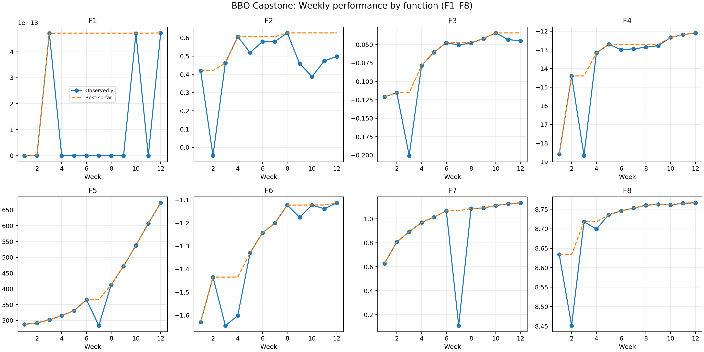
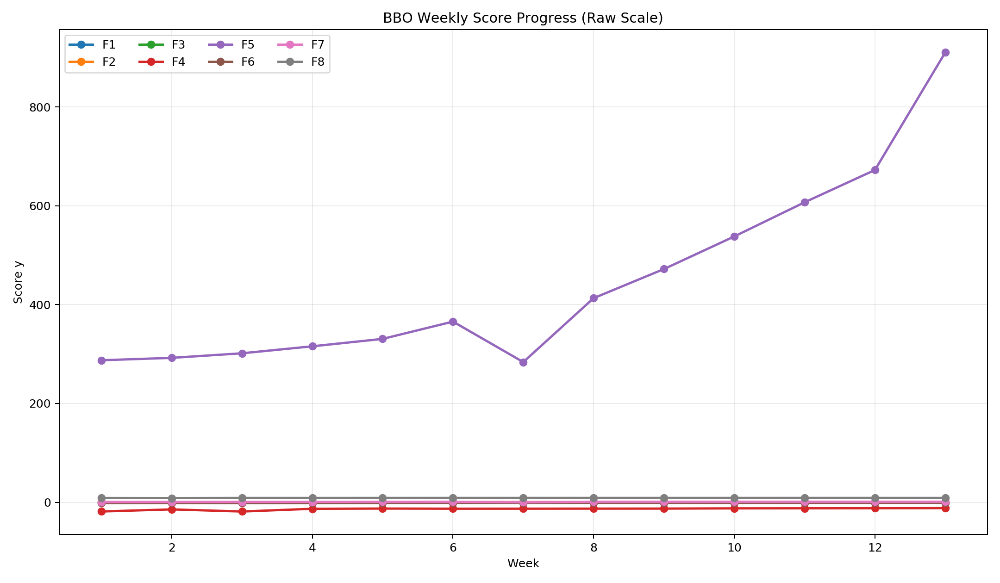
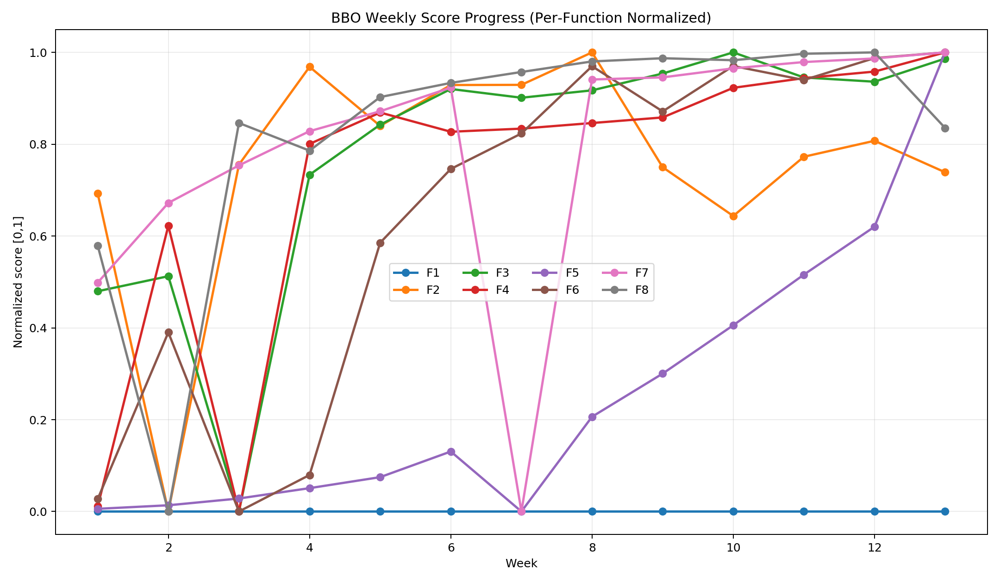
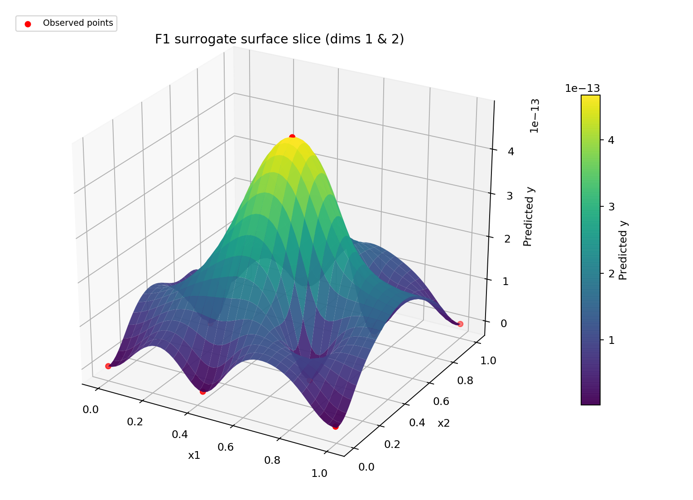
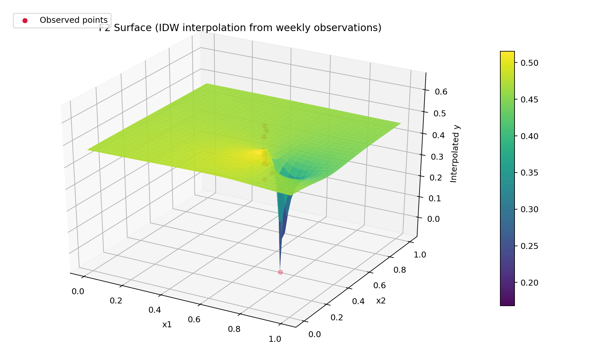

# Imperial BBO Capstone — Black-Box Optimization (8 Functions)

A student-friendly repository for my Imperial College London AI/ML capstone project.

## Project overview
This project optimizes **8 black-box objective functions (F1–F8)** over weekly iterations.

- **Weeks 1–4:** random/manual exploration
- **Weeks 5 onward:** machine-learning-guided optimization (Ridge, BO/GP-EI, trust-region variants, and controlled manual heuristics)

## Repository structure

- `scripts/` → runnable Python scripts by week (source of truth)
- `notebooks/` → Jupyter notebook versions of weekly work
- `docs/DATASHEET.md` → datasheet for capstone dataset (required)
- `docs/MODEL_CARD.md` → model card for optimization approach (required)
- `data/` → query history + evaluation results (add your CSVs here)
- `results/` → weekly summaries and plots

## Quick start

```bash
python -m venv .venv
source .venv/bin/activate   # Windows: .venv\Scripts\activate
pip install -r requirements.txt
python scripts/capstoneweek13.py
```

## Non-technical explanation (for a general audience)
This project tries to improve eight unknown “black-box” systems by making one careful guess each week and learning from the returned score. Think of it like tuning a complex machine without seeing its internal wiring: we only observe what we try and how well it performs. I started with broad trial points, then moved to machine-learning-guided search so each new guess became more informed than the last. Over time, the strategy shifted from exploration to precise local refinement, which improved stability and final performance. The repository documents that full journey, including methods, results, limitations, and what changed after each week’s feedback.

## Data
- Weekly query inputs and outputs are archived under `data/weekly_results/`.
- A project datasheet documenting data structure, constraints, and collection logic is in `docs/DATASHEET.md`.

## Model and optimisation approach
- Core methods evolved from Ridge surrogates to local GP+EI and trust-region style BO.
- Latest planning includes ensemble surrogate scoring (GP + Gradient Boosting) with function-specific exploration/exploitation settings.
- Full model details, assumptions, trade-offs, and limitations are in `docs/MODEL_CARD.md`.

## Hyperparameter optimisation
- Hyperparameters were tuned in a practical, week-by-week way (e.g., trust-region radius, candidate pool sizes, EI/UCB balance, sigma scaling, restart seeds).
- Tuning focused on stable incremental improvement under tiny-data constraints.

## Results
- Week-by-week results and reflections: `results/weekly_summary.md`
- Reproducible weekly scripts: `scripts/`
- Notebook presentation versions: `notebooks/`
- Professional visual outputs: `results/plots/`

### Plot pack (submission-ready)
Generated with:
```bash
python scripts/generate_visualizations.py
```
This creates:
- `results/plots/convergence_all_functions.png`
- `results/plots/F1_surface_slice.png` ... `F8_surface_slice.png`
- `results/plots/F1_contour_slice.png` ... `F8_contour_slice.png`

Example:


### Plot assets (for final report)
Generate plots:
```bash
python scripts/generate_plots.py
```

Generated images:
- `results/plots/function_progress.png`
- `results/plots/function_progress_normalized.png`
- `results/plots/f1_surface_idw.png`
- `results/plots/f2_surface_idw.png`

Example visuals:






## Weekly method evolution (what was done + what improved)

- **Week 5**
  - **What was done:** Introduced Ridge-regression surrogates for selected functions (F2, F5, F7) using Weeks 1–4 data.
  - **What improved:** First shift from manual guessing to model-guided search; more stable direction selection on low-data regime.

- **Week 6**
  - **What was done:** Moved to a mixed policy: stronger ML exploitation on F5/F7, safer local ML for F2/F3/F4/F8, manual/exploration for F1/F6.
  - **What improved:** Better risk control by matching strategy to function behavior; fewer overly aggressive jumps.

- **Week 7**
  - **What was done:** Added BO-style GP+EI for F5/F7 while keeping Ridge for F2/F3/F4/F8 and heuristics for F1/F6.
  - **What improved:** Better nonlinear handling on higher-impact functions and stronger exploration/exploitation balance.

- **Week 8**
  - **What was done:** Switched F5/F7 to trust-region BO (local-only GP+EI), keeping Ridge local tuning on F2/F3/F4/F8.
  - **What improved:** Reduced damage from global jumps; improved consistency through controlled local search.

- **Week 9**
  - **What was done:** Entered micro-refinement phase: tiny local steps (Ridge or trust-region BO) around incumbents.
  - **What improved:** Higher precision late-stage optimization and steadier incremental gains.

- **Week 10**
  - **What was done:** Generalized trust-region BO workflow across F2–F8 with deterministic local GP+EI and robustness fallbacks; incumbent-safe handling for F1.
  - **What improved:** More unified optimization pipeline and improved reproducibility.

- **Week 11**
  - **What was done:** Hybrid continuation from Week 10: maximin exploration for weak-signal F1, adaptive local GP+EI for F2–F7, fixed-dimension-aware local BO for F8.
  - **What improved:** More function-aware policy design and better handling of constrained/fixed-coordinate behavior in F8.

- **Week 12**
  - **What was done:** Continued Week 11 structure in a cleaned student-friendly script/notebook pipeline, preserving adaptive local BO behavior and consistent output formatting.
  - **What improved:** Better repository consistency and easier week-to-week comparison/maintenance.

- **Week 13**
  - **What was done:** Upgraded to ensemble surrogate search (GP + Gradient Boosting), hybrid UCB/EI scoring, multi-center trust-region candidate generation, and function-specific tuning (including F8 blockwise exploration with all dimensions active).
  - **What improved:** Stronger robustness to surrogate bias, broader but controlled exploration, and more informed candidate ranking in late-stage optimization.

## Required assignment documents

- Datasheet: `docs/DATASHEET.md`
- Model card: `docs/MODEL_CARD.md`

## Reproducibility notes

- Input vectors are clipped to `[0, 0.999999]` for portal compatibility.
- Queries are printed in portal format: `0.xxxxxx-0.xxxxxx-...`
- Comments were standardized for student readability and method rationale.

## TODO before final submission

- [ ] Add your actual dataset files to `data/`
- [ ] Fill missing placeholders in `docs/DATASHEET.md`
- [ ] Fill missing placeholders in `docs/MODEL_CARD.md`
- [ ] Add plots in `results/plots/`
- [ ] Make repo public and submit GitHub link
